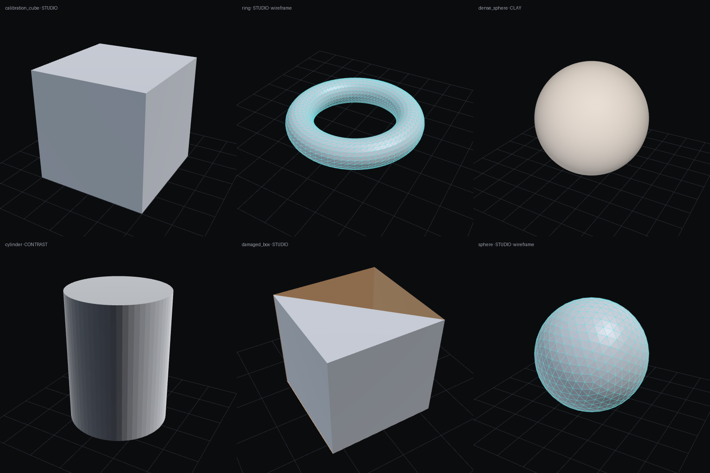

# MeshGen

On-device 3D mesh generator for Android. No cloud APIs — all AI runs on the phone.

| Engine | What it does | Status |
|---|---|---|
| — Viewer + export | Orbit/zoom/pan viewer, mesh health check, simplify, STL / 3MF / OBJ / GLB export | Done (Phase 1) |
| 01 Text → Shape | Local LLM writes a constrained shape recipe (JSON DSL) → watertight, editable, printable mesh | Planned (Phases 2–3) |
| 02 Photo → 3D | Background removal + TripoSR single-image reconstruction | Planned (Phase 4), experimental |
| 03 Camera Capture | ARCore depth + TSDF fusion + marching cubes | Planned (Phase 5), experimental |


<sub>Desktop render of the in-app viewer's shaders (`tools/render_preview.py`).</sub>

See [PROGRESS.md](PROGRESS.md) for current state and [MODELS.md](MODELS.md) for AI model licenses.

## Install on your phone (3 steps)

1. On your phone, open **https://github.com/ikhanai777/Meshgen/releases/latest** and tap the file named `MeshGen-0.0.N.apk` (not the `-debug` one) under **Assets**.
2. When the download finishes, tap it. If Android asks, allow your browser to **"Install unknown apps"** (one-time), then go back and tap the file again.
3. Tap **Install**, then **Open**. Future versions install right over the old one — your data is kept.

Builds from work-in-progress branches (before they're merged into `main`) appear at
**https://github.com/ikhanai777/Meshgen/releases/tag/dev-build**.

> If Play Protect warns about an unknown developer, tap **More details → Install anyway**. This happens because the app isn't from the Play Store.

## How builds work

Every push runs `.github/workflows/android.yml` on GitHub Actions:

- runs the unit tests,
- builds a **release APK** (small, optimized — the one to install) and a **debug APK** (installs side-by-side as "MeshGen Debug" with package `com.meshgen.app.debug`, used for troubleshooting),
- uploads both as a workflow artifact,
- on `main`: publishes a GitHub Release `v0.0.<build number>` marked *Latest*;
- on any other branch: replaces the rolling pre-release `dev-build`.

### Release signing

By default both APKs are signed with a **public test key** committed in `signing/` so every build installs over the previous one. That is fine for testing but **not** for the Play Store, since anyone could sign an app with that key.

Before publishing publicly, add a private key as repository secrets (Settings → Secrets and variables → Actions):
`KEYSTORE_BASE64` (base64 of a `.jks` file), `KEYSTORE_PASSWORD`, `KEY_ALIAS`, `KEY_PASSWORD`.
The workflow picks it up automatically. Note: switching keys means uninstalling the test-key version once.

## Repo layout

```
.github/workflows/android.yml   CI: tests, APKs, releases
core/                           Pure Kotlin (no Android): mesh, cleanup, decimation, exporters, samples
  src/test/                     Fast JVM unit tests
app/                            Android app (Kotlin, Jetpack Compose, single activity, MVVM)
  src/main/java/com/meshgen/app/
    MainActivity.kt
    device/                     RAM / SoC / GPU detection, device tier
    viewer/                     OpenGL ES 3 mesh viewer (renderer, orbit camera, touch)
    files/                      Share sheet + save to Downloads
    ui/theme/                   Graphite + cyan design system
    ui/navigation/              Compose navigation graph
    ui/home/  ui/engine/  ui/viewer/  ui/samples/  ui/library/  ui/models/
  src/main/assets/shaders/      GLSL ES 3.0 shaders
  src/test/                     JVM unit tests
tools/render_preview.py         Desktop render of the viewer shaders
signing/                        Public test signing key (testing only)
gradle/libs.versions.toml       Dependency versions
```

Planned additions: SDF, shape DSL and marching cubes go into `:core`; modules per engine for native/ML dependencies.

## Building locally (optional)

Requires JDK 17+ and the Android SDK: `./gradlew :core:test :app:testDebugUnitTest assembleDebug assembleRelease`.
